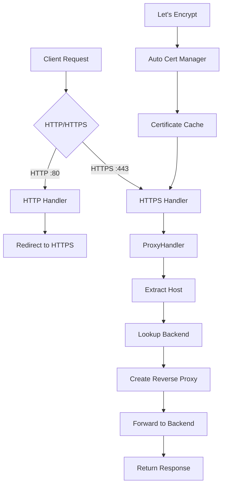

# Diagrams

## Architecture Flow

```mermaid
graph TB
    A[Client Request] --> B{HTTP/HTTPS}
    B -->|HTTP :80| C[HTTP Handler]
    B -->|HTTPS :443| D[HTTPS Handler]
    C --> E[Redirect to HTTPS]
    D --> F[ProxyHandler]
    F --> G[Extract Host]
    G --> H[Lookup Backend]
    H --> I[Create Reverse Proxy]
    I --> J[Forward to Backend]
    J --> K[Return Response]
    
    L[Let's Encrypt] --> M[Auto Cert Manager]
    M --> N[Certificate Cache]
    N --> D
```
