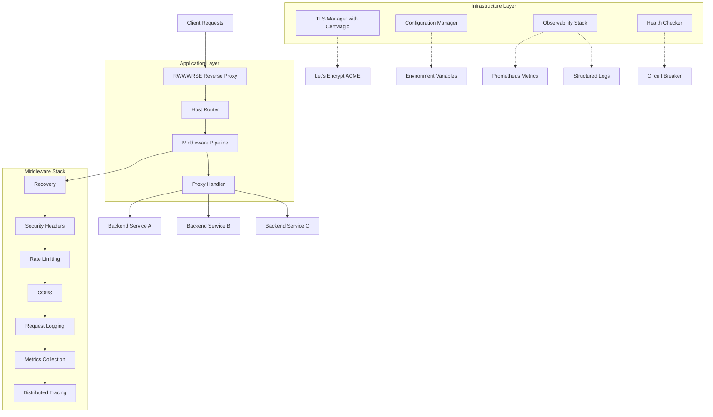
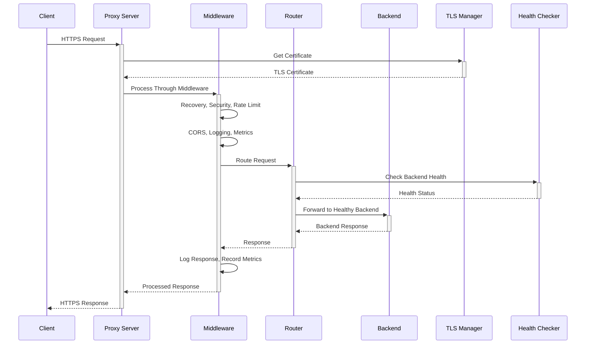

# RWWWRSE - Modern Go Reverse Proxy Server Architecture

## Executive Summary

RWWWRSE is a modern, production-ready reverse proxy server written in Go that replaces an existing implementation with enterprise-grade features including automatic TLS management, observability, security, and high availability. This architecture follows Go best practices, implements dependency injection for testability, and provides a robust foundation for scaling.

## Table of Contents

1. [System Overview](#system-overview)
2. [Package Structure](#package-structure)
3. [Core Interfaces](#core-interfaces)
4. [Configuration Architecture](#configuration-architecture)
5. [TLS Management Architecture](#tls-management-architecture)
6. [Middleware Pipeline](#middleware-pipeline)
7. [Error Handling Strategy](#error-handling-strategy)
8. [Observability Architecture](#observability-architecture)
9. [Testing Strategy](#testing-strategy)
10. [Deployment Architecture](#deployment-architecture)
11. [Security Architecture](#security-architecture)
12. [Implementation Guidance](#implementation-guidance)

## System Overview

### High-Level Architecture



### Request Processing Flow



### Core Components

1. **Application Layer**: Request routing, middleware processing, and proxy handling
2. **Infrastructure Layer**: TLS management, configuration, health monitoring, observability
3. **Security Layer**: Rate limiting, CORS, security headers, input validation
4. **Observability Layer**: Structured logging, metrics collection, distributed tracing

## Package Structure

Following Go best practices and agent.md guidelines:

```
rwwwrse/
├── cmd/
│   └── rwwwrse/
│       ├── main.go                 # Application entry point
│       └── wire.go                 # Dependency injection setup
├── internal/
│   ├── app/                        # Application orchestration
│   │   ├── app.go                  # App lifecycle management
│   │   ├── server.go               # HTTP server setup
│   │   └── signals.go              # Signal handling
│   ├── config/                     # Configuration management
│   │   ├── config.go               # Configuration structures
│   │   ├── loader.go               # Environment loading with Viper
│   │   ├── validator.go            # Configuration validation
│   │   └── defaults.go             # Default values
│   ├── proxy/                      # Core proxy functionality
│   │   ├── router.go               # Host-based request routing
│   │   ├── handler.go              # HTTP proxy handler
│   │   ├── backend.go              # Backend service management
│   │   ├── pool.go                 # Connection pooling
│   │   └── transport.go            # HTTP transport configuration
│   ├── tls/                        # TLS certificate management
│   │   ├── manager.go              # TLS certificate manager interface
│   │   ├── certmagic.go            # CertMagic implementation
│   │   ├── storage.go              # Certificate storage
│   │   └── provider.go             # Certificate provider abstraction
│   ├── middleware/                 # HTTP middleware components
│   │   ├── recovery.go             # Panic recovery
│   │   ├── security.go             # Security headers
│   │   ├── ratelimit.go            # Rate limiting
│   │   ├── cors.go                 # CORS handling
│   │   ├── logging.go              # Request/response logging
│   │   ├── metrics.go              # Metrics collection
│   │   ├── tracing.go              # Distributed tracing
│   │   └── chain.go                # Middleware chaining
│   ├── health/                     # Health monitoring
│   │   ├── checker.go              # Health check orchestration
│   │   ├── backend.go              # Backend health monitoring
│   │   ├── circuit.go              # Circuit breaker implementation
│   │   └── status.go               # Health status types
│   ├── observability/              # Observability components
│   │   ├── logger.go               # Structured logging with slog
│   │   ├── metrics.go              # Prometheus metrics
│   │   ├── tracing.go              # OpenTelemetry tracing
│   │   └── profiling.go            # pprof integration
│   └── errors/                     # Error handling
│       ├── types.go                # Custom error types
│       ├── codes.go                # Error codes and classifications
│       ├── handler.go              # HTTP error response handling
│       └── wrapped.go              # Error wrapping utilities
├── pkg/                            # Public packages (minimal)
├── api/                            # API definitions
│   └── health/                     # Health check endpoints
├── deployments/                    # Deployment configurations
│   ├── docker/
│   │   ├── Dockerfile.multi-stage
│   │   └── docker-compose.yml
│   └── k8s/                        # Kubernetes manifests
│       ├── deployment.yaml
│       ├── service.yaml
│       ├── configmap.yaml
│       └── ingress.yaml
├── scripts/                        # Build and operational scripts
│   ├── build.sh
│   ├── test.sh
│   └── deploy.sh
├── docs/                           # Documentation
│   ├── ARCHITECTURE.md             # This document
│   ├── CONFIG.md                   # Configuration guide
│   ├── DEPLOYMENT.md               # Deployment guide
│   └── MONITORING.md               # Monitoring guide
└── tests/                          # Integration and E2E tests
    ├── integration/
    │   ├── proxy_test.go
    │   ├── tls_test.go
    │   └── health_test.go
    └── e2e/
        ├── end_to_end_test.go
        └── load_test.go
```

## Core Interfaces

Following agent.md guidelines for small, focused interfaces defined at the point of use:

### Application Interfaces

```go
// Router defines request routing based on host
type Router interface {
    Route(ctx context.Context, host string) (Backend, error)
    Register(host string, backend Backend) error
    Unregister(host string) error
    Backends() map[string]Backend
}

// Backend represents a proxy backend service
type Backend interface {
    URL() *url.URL
    Transport() http.RoundTripper
    IsHealthy(ctx context.Context) bool
    Name() string
}

// ProxyHandler handles the core proxying logic
type ProxyHandler interface {
    ServeHTTP(w http.ResponseWriter, r *http.Request)
    Shutdown(ctx context.Context) error
}
```

### Infrastructure Interfaces

```go
// TLSManager manages TLS certificates
type TLSManager interface {
    GetCertificate(hello *tls.ClientHelloInfo) (*tls.Certificate, error)
    Start(ctx context.Context) error
    Stop(ctx context.Context) error
}

// ConfigLoader loads and validates configuration
type ConfigLoader interface {
    Load() (*Config, error)
    Watch(ctx context.Context) (<-chan *Config, error)
    Validate(cfg *Config) error
}

// HealthChecker monitors service health
type HealthChecker interface {
    Check(ctx context.Context, backend Backend) HealthStatus
    StartMonitoring(ctx context.Context) error
    StopMonitoring() error
    Subscribe(ch chan<- HealthEvent) error
}
```

### Observability Interfaces

```go
// Logger provides structured logging
type Logger interface {
    Debug(ctx context.Context, msg string, fields ...Field)
    Info(ctx context.Context, msg string, fields ...Field)
    Warn(ctx context.Context, msg string, fields ...Field)
    Error(ctx context.Context, err error, msg string, fields ...Field)
    WithFields(fields ...Field) Logger
}

// MetricsCollector collects application metrics
type MetricsCollector interface {
    RecordRequest(method, host, status string, duration time.Duration)
    RecordBackendRequest(backend, status string, duration time.Duration)
    IncActiveConnections()
    DecActiveConnections()
    RecordCertificateRenewal(domain string, success bool)
}

// Tracer provides distributed tracing
type Tracer interface {
    StartSpan(ctx context.Context, name string) (context.Context, Span)
    InjectHeaders(ctx context.Context, headers http.Header)
    ExtractHeaders(headers http.Header) context.Context
}
```

### Middleware Interfaces

```go
// Middleware represents HTTP middleware
type Middleware interface {
    Wrap(http.Handler) http.Handler
}

// RateLimiter provides rate limiting functionality
type RateLimiter interface {
    Allow(ctx context.Context, key string) bool
    Reset(key string) error
    Stats(key string) RateLimitStats
}

// SecurityHeaderProvider adds security headers
type SecurityHeaderProvider interface {
    AddHeaders(w http.ResponseWriter, r *http.Request)
    Configure(policy SecurityPolicy) error
}
```

## Configuration Architecture

### Environment Variable Schema

All configuration uses the `RWWWRSE_` prefix for consistency with the existing implementation:

```go
type Config struct {
    Server      ServerConfig      `mapstructure:"server" validate:"required"`
    TLS         TLSConfig         `mapstructure:"tls" validate:"required"`
    Backends    BackendsConfig    `mapstructure:"backends" validate:"required"`
    Security    SecurityConfig    `mapstructure:"security"`
    Logging     LoggingConfig     `mapstructure:"logging"`
    Metrics     MetricsConfig     `mapstructure:"metrics"`
    Health      HealthConfig      `mapstructure:"health"`
    RateLimit   RateLimitConfig   `mapstructure:"ratelimit"`
}

type ServerConfig struct {
    Host         string        `mapstructure:"host" default:"0.0.0.0"`
    Port         int           `mapstructure:"port" default:"8080" validate:"min=1,max=65535"`
    HTTPSPort    int           `mapstructure:"https_port" default:"8443" validate:"min=1,max=65535"`
    ReadTimeout  time.Duration `mapstructure:"read_timeout" default:"30s"`
    WriteTimeout time.Duration `mapstructure:"write_timeout" default:"30s"`
    IdleTimeout  time.Duration `mapstructure:"idle_timeout" default:"60s"`
    GracefulTimeout time.Duration `mapstructure:"graceful_timeout" default:"30s"`
}

type TLSConfig struct {
    Enabled     bool     `mapstructure:"enabled" default:"true"`
    AutoCert    bool     `mapstructure:"auto_cert" default:"true"`
    Email       string   `mapstructure:"email" validate:"required_if=AutoCert true,email"`
    Domains     []string `mapstructure:"domains" validate:"required_if=AutoCert true,min=1"`
    CacheDir    string   `mapstructure:"cache_dir" default:"/tmp/certs"`
    Staging     bool     `mapstructure:"staging" default:"false"`
    RenewBefore time.Duration `mapstructure:"renew_before" default:"720h"` // 30 days
}

type BackendsConfig struct {
    Routes map[string]BackendRoute `mapstructure:"routes" validate:"required,min=1"`
}

type BackendRoute struct {
    URL             string        `mapstructure:"url" validate:"required,url"`
    HealthPath      string        `mapstructure:"health_path" default:"/health"`
    HealthInterval  time.Duration `mapstructure:"health_interval" default:"30s"`
    Timeout         time.Duration `mapstructure:"timeout" default:"30s"`
    MaxIdleConns    int           `mapstructure:"max_idle_conns" default:"100"`
    MaxIdlePerHost  int           `mapstructure:"max_idle_per_host" default:"10"`
    DialTimeout     time.Duration `mapstructure:"dial_timeout" default:"10s"`
}

type SecurityConfig struct {
    Headers          SecurityHeaders `mapstructure:"headers"`
    RateLimitEnabled bool           `mapstructure:"rate_limit_enabled" default:"true"`
    CORSEnabled      bool           `mapstructure:"cors_enabled" default:"true"`
    CORSOrigins      []string       `mapstructure:"cors_origins" default:"*"`
}

type SecurityHeaders struct {
    ContentTypeNosniff    bool   `mapstructure:"content_type_nosniff" default:"true"`
    FrameOptions          string `mapstructure:"frame_options" default:"DENY"`
    ContentSecurityPolicy string `mapstructure:"content_security_policy" default:"default-src 'self'"`
    StrictTransportSecurity string `mapstructure:"strict_transport_security" default:"max-age=31536000; includeSubDomains"`
    ReferrerPolicy        string `mapstructure:"referrer_policy" default:"strict-origin-when-cross-origin"`
}

type LoggingConfig struct {
    Level  string `mapstructure:"level" default:"info" validate:"oneof=debug info warn error"`
    Format string `mapstructure:"format" default:"json" validate:"oneof=json text"`
    Output string `mapstructure:"output" default:"stdout"`
}

type MetricsConfig struct {
    Enabled bool   `mapstructure:"enabled" default:"true"`
    Path    string `mapstructure:"path" default:"/metrics"`
    Port    int    `mapstructure:"port" default:"9090" validate:"min=1,max=65535"`
}

type HealthConfig struct {
    Enabled      bool          `mapstructure:"enabled" default:"true"`
    Path         string        `mapstructure:"path" default:"/health"`
    Timeout      time.Duration `mapstructure:"timeout" default:"5s"`
    Interval     time.Duration `mapstructure:"interval" default:"30s"`
    UnhealthyThreshold int     `mapstructure:"unhealthy_threshold" default:"3"`
    HealthyThreshold   int     `mapstructure:"healthy_threshold" default:"2"`
}

type RateLimitConfig struct {
    RequestsPerSecond float64       `mapstructure:"requests_per_second" default:"100"`
    BurstSize         int           `mapstructure:"burst_size" default:"200"`
    CleanupInterval   time.Duration `mapstructure:"cleanup_interval" default:"10m"`
}
```

### Environment Variables

| Variable | Description | Default | Example |
|----------|-------------|---------|---------|
| `RWWWRSE_SERVER_HOST` | Server bind address | `0.0.0.0` | `0.0.0.0` |
| `RWWWRSE_SERVER_PORT` | HTTP port | `8080` | `8080` |
| `RWWWRSE_SERVER_HTTPS_PORT` | HTTPS port | `8443` | `443` |
| `RWWWRSE_TLS_EMAIL` | Let's Encrypt email | - | `admin@example.com` |
| `RWWWRSE_TLS_DOMAINS` | Comma-separated domains | - | `api.site.com,www.site.com` |
| `RWWWRSE_TLS_CACHE_DIR` | Certificate cache directory | `/tmp/certs` | `/etc/certs` |
| `RWWWRSE_TLS_STAGING` | Use Let's Encrypt staging | `false` | `true` |
| `RWWWRSE_BACKENDS_ROUTES_<HOST>_URL` | Backend URL for host | - | `http://localhost:3000` |
| `RWWWRSE_LOGGING_LEVEL` | Log level | `info` | `debug` |
| `RWWWRSE_METRICS_ENABLED` | Enable metrics | `true` | `false` |

### Configuration Loading

```go
type configLoader struct {
    validator *validator.Validate
}

func (l *configLoader) Load() (*Config, error) {
    viper.SetConfigName("config")
    viper.SetConfigType("yaml")
    viper.AddConfigPath("/etc/rwwwrse/")
    viper.AddConfigPath(".")
    
    // Environment variable configuration
    viper.SetEnvPrefix("RWWWRSE")
    viper.SetEnvKeyReplacer(strings.NewReplacer(".", "_"))
    viper.AutomaticEnv()
    
    // Set defaults
    setDefaults()
    
    // Read config file if it exists
    if err := viper.ReadInConfig(); err != nil {
        if _, ok := err.(viper.ConfigFileNotFoundError); !ok {
            return nil, fmt.Errorf("failed to read config file: %w", err)
        }
    }
    
    var cfg Config
    if err := viper.Unmarshal(&cfg); err != nil {
        return nil, fmt.Errorf("failed to unmarshal config: %w", err)
    }
    
    if err := l.Validate(&cfg); err != nil {
        return nil, fmt.Errorf("invalid configuration: %w", err)
    }
    
    return &cfg, nil
}
```

## TLS Management Architecture

### CertMagic Integration

```go
type tlsManager struct {
    config     *TLSConfig
    certmagic  *certmagic.Config
    logger     Logger
    metrics    MetricsCollector
}

func NewTLSManager(cfg *TLSConfig, logger Logger, metrics MetricsCollector) TLSManager {
    cache := certmagic.NewCache(certmagic.CacheOptions{
        GetConfigForCert: func(cert certmagic.Certificate) (*certmagic.Config, error) {
            return certmagic.New(cache, certmagic.Config{
                Storage: &certmagic.FileStorage{Path: cfg.CacheDir},
            }), nil
        },
    })
    
    magic := certmagic.New(cache, certmagic.Config{
        Storage: &certmagic.FileStorage{Path: cfg.CacheDir},
        OnEvent: func(ctx context.Context, event string, data map[string]interface{}) {
            logger.Info(ctx, "TLS event", 
                slog.String("event", event),
                slog.Any("data", data),
            )
        },
    })
    
    if cfg.AutoCert {
        acmeIssuer := certmagic.NewACMEIssuer(magic, certmagic.ACMEIssuer{
            CA:                cfg.GetCAEndpoint(),
            Email:             cfg.Email,
            Agreed:            true,
            DisableHTTPChallenge: false,
            DisableTLSALPNChallenge: false,
        })
        magic.Issuers = []certmagic.Issuer{acmeIssuer}
    }
    
    return &tlsManager{
        config:    cfg,
        certmagic: magic,
        logger:    logger,
        metrics:   metrics,
    }
}

func (t *tlsManager) GetCertificate(hello *tls.ClientHelloInfo) (*tls.Certificate, error) {
    start := time.Now()
    defer func() {
        t.metrics.RecordCertificateRequest(hello.ServerName, time.Since(start))
    }()
    
    cert, err := t.certmagic.GetCertificate(hello)
    if err != nil {
        t.logger.Error(context.Background(), err, "failed to get certificate",
            slog.String("server_name", hello.ServerName),
        )
        return nil, err
    }
    
    return cert, nil
}

func (t *tlsManager) Start(ctx context.Context) error {
    if !t.config.AutoCert {
        return nil
    }
    
    return t.certmagic.ManageSync(ctx, t.config.Domains)
}
```

### Certificate Storage Strategy

1. **File-based storage** for single-instance deployments
2. **Distributed storage** (Redis/etcd) for multi-instance deployments
3. **Automatic backup** and rotation
4. **Certificate monitoring** and renewal alerts

## Middleware Pipeline

### Middleware Chain Design

```go
type middlewareChain struct {
    middlewares []Middleware
    logger      Logger
}

func NewMiddlewareChain(logger Logger) *middlewareChain {
    return &middlewareChain{
        middlewares: make([]Middleware, 0),
        logger:      logger,
    }
}

func (c *middlewareChain) Use(middleware Middleware) {
    c.middlewares = append(c.middlewares, middleware)
}

func (c *middlewareChain) Build(handler http.Handler) http.Handler {
    // Build middleware chain in reverse order
    for i := len(c.middlewares) - 1; i >= 0; i-- {
        handler = c.middlewares[i].Wrap(handler)
    }
    return handler
}

// Standard middleware order (from outer to inner):
// 1. Recovery (catch panics)
// 2. Security Headers (add security headers)
// 3. Rate Limiting (enforce rate limits)
// 4. CORS (handle CORS requests)
// 5. Request Logging (log requests)
// 6. Metrics Collection (collect metrics)
// 7. Distributed Tracing (add tracing)
```

### Core Middleware Components

#### Recovery Middleware
```go
type recoveryMiddleware struct {
    logger Logger
}

func (m *recoveryMiddleware) Wrap(next http.Handler) http.Handler {
    return http.HandlerFunc(func(w http.ResponseWriter, r *http.Request) {
        defer func() {
            if err := recover(); err != nil {
                m.logger.Error(r.Context(), fmt.Errorf("panic: %v", err), "request panic",
                    slog.String("method", r.Method),
                    slog.String("path", r.URL.Path),
                    slog.String("remote_addr", r.RemoteAddr),
                )
                http.Error(w, "Internal Server Error", http.StatusInternalServerError)
            }
        }()
        next.ServeHTTP(w, r)
    })
}
```

#### Rate Limiting Middleware
```go
type rateLimitMiddleware struct {
    limiter RateLimiter
    logger  Logger
}

func (m *rateLimitMiddleware) Wrap(next http.Handler) http.Handler {
    return http.HandlerFunc(func(w http.ResponseWriter, r *http.Request) {
        key := m.getClientKey(r)
        
        if !m.limiter.Allow(r.Context(), key) {
            m.logger.Warn(r.Context(), "rate limit exceeded",
                slog.String("client", key),
                slog.String("path", r.URL.Path),
            )
            http.Error(w, "Rate limit exceeded", http.StatusTooManyRequests)
            return
        }
        
        next.ServeHTTP(w, r)
    })
}

func (m *rateLimitMiddleware) getClientKey(r *http.Request) string {
    // Use X-Forwarded-For if behind proxy, otherwise RemoteAddr
    if xff := r.Header.Get("X-Forwarded-For"); xff != "" {
        return strings.Split(xff, ",")[0]
    }
    host, _, _ := net.SplitHostPort(r.RemoteAddr)
    return host
}
```

## Error Handling Strategy

### Custom Error Types

```go
// ProxyError represents proxy-specific errors
type ProxyError struct {
    Code    ProxyErrorCode
    Message string
    Cause   error
    Context map[string]interface{}
}

type ProxyErrorCode int

const (
    ErrCodeBackendUnavailable ProxyErrorCode = iota + 1000
    ErrCodeBackendTimeout
    ErrCodeInvalidHost
    ErrCodeTLSHandshake
    ErrCodeRateLimited
    ErrCodeConfigInvalid
    ErrCodeHealthCheckFailed
)

func (e *ProxyError) Error() string {
    if e.Cause != nil {
        return fmt.Sprintf("%s: %v", e.Message, e.Cause)
    }
    return e.Message
}

func (e *ProxyError) Unwrap() error {
    return e.Cause
}

func (e *ProxyError) Is(target error) bool {
    if t, ok := target.(*ProxyError); ok {
        return e.Code == t.Code
    }
    return false
}

// Error creation helpers
func NewBackendError(backend string, cause error) *ProxyError {
    return &ProxyError{
        Code:    ErrCodeBackendUnavailable,
        Message: fmt.Sprintf("backend %s unavailable", backend),
        Cause:   cause,
        Context: map[string]interface{}{"backend": backend},
    }
}

func WrapError(code ProxyErrorCode, message string, cause error) *ProxyError {
    return &ProxyError{
        Code:    code,
        Message: message,
        Cause:   cause,
        Context: make(map[string]interface{}),
    }
}
```

### Error Response Handling

```go
type errorHandler struct {
    logger Logger
}

func (h *errorHandler) HandleError(w http.ResponseWriter, r *http.Request, err error) {
    var proxyErr *ProxyError
    
    if errors.As(err, &proxyErr) {
        h.handleProxyError(w, r, proxyErr)
        return
    }
    
    // Handle standard HTTP errors
    if errors.Is(err, context.DeadlineExceeded) {
        h.writeErrorResponse(w, r, http.StatusGatewayTimeout, "Gateway Timeout", err)
        return
    }
    
    if errors.Is(err, context.Canceled) {
        h.writeErrorResponse(w, r, http.StatusRequestTimeout, "Request Canceled", err)
        return
    }
    
    // Default to internal server error
    h.writeErrorResponse(w, r, http.StatusInternalServerError, "Internal Server Error", err)
}

func (h *errorHandler) handleProxyError(w http.ResponseWriter, r *http.Request, err *ProxyError) {
    switch err.Code {
    case ErrCodeBackendUnavailable:
        h.writeErrorResponse(w, r, http.StatusBadGateway, "Backend Unavailable", err)
    case ErrCodeBackendTimeout:
        h.writeErrorResponse(w, r, http.StatusGatewayTimeout, "Backend Timeout", err)
    case ErrCodeInvalidHost:
        h.writeErrorResponse(w, r, http.StatusNotFound, "Invalid Host", err)
    case ErrCodeRateLimited:
        h.writeErrorResponse(w, r, http.StatusTooManyRequests, "Rate Limited", err)
    default:
        h.writeErrorResponse(w, r, http.StatusInternalServerError, "Proxy Error", err)
    }
}

func (h *errorHandler) writeErrorResponse(w http.ResponseWriter, r *http.Request, status int, message string, err error) {
    h.logger.Error(r.Context(), err, "request error",
        slog.Int("status", status),
        slog.String("method", r.Method),
        slog.String("path", r.URL.Path),
        slog.String("host", r.Host),
        slog.String("remote_addr", r.RemoteAddr),
    )
    
    w.Header().Set("Content-Type", "application/json")
    w.WriteHeader(status)
    
    response := map[string]interface{}{
        "error":   message,
        "status":  status,
        "path":    r.URL.Path,
        "method":  r.Method,
        "timestamp": time.Now().UTC().Format(time.RFC3339),
    }
    
    json.NewEncoder(w).Encode(response)
}
```

## Observability Architecture

### Structured Logging with slog

```go
type logger struct {
    slog    *slog.Logger
    level   slog.Level
    context map[string]interface{}
}

func NewLogger(cfg LoggingConfig) Logger {
    var handler slog.Handler
    
    opts := &slog.HandlerOptions{
        Level: parseLogLevel(cfg.Level),
    }
    
    switch cfg.Format {
    case "json":
        handler = slog.NewJSONHandler(getOutput(cfg.Output), opts)
    default:
        handler = slog.NewTextHandler(getOutput(cfg.Output), opts)
    }
    
    return &logger{
        slog:    slog.New(handler),
        level:   parseLogLevel(cfg.Level),
        context: make(map[string]interface{}),
    }
}

func (l *logger) Error(ctx context.Context, err error, msg string, fields ...Field) {
    if !l.slog.Enabled(ctx, slog.LevelError) {
        return
    }
    
    attrs := []slog.Attr{
        slog.String("error", err.Error()),
    }
    
    if requestID := getRequestID(ctx); requestID != "" {
        attrs = append(attrs, slog.String("request_id", requestID))
    }
    
    for _, field := range fields {
        attrs = append(attrs, field.ToSlogAttr())
    }
    
    l.slog.LogAttrs(ctx, slog.LevelError, msg, attrs...)
}
```

### Prometheus Metrics

```go
type metricsCollector struct {
    requestsTotal     *prometheus.CounterVec
    requestDuration   *prometheus.HistogramVec
    backendRequests   *prometheus.CounterVec
    activeConnections prometheus.Gauge
    certificateRenewals *prometheus.CounterVec
}

func NewMetricsCollector() MetricsCollector {
    m := &metricsCollector{
        requestsTotal: prometheus.NewCounterVec(
            prometheus.CounterOpts{
                Name: "rwwwrse_requests_total",
                Help: "Total number of HTTP requests",
            },
            []string{"method", "host", "status"},
        ),
        requestDuration: prometheus.NewHistogramVec(
            prometheus.HistogramOpts{
                Name:    "rwwwrse_request_duration_seconds",
                Help:    "HTTP request duration in seconds",
                Buckets: prometheus.DefBuckets,
            },
            []string{"method", "host"},
        ),
        backendRequests: prometheus.NewCounterVec(
            prometheus.CounterOpts{
                Name: "rwwwrse_backend_requests_total",
                Help: "Total number of backend requests",
            },
            []string{"backend", "status"},
        ),
        activeConnections: prometheus.NewGauge(
            prometheus.GaugeOpts{
                Name: "rwwwrse_active_connections",
                Help: "Number of active connections",
            },
        ),
        certificateRenewals: prometheus.NewCounterVec(
            prometheus.CounterOpts{
                Name: "rwwwrse_certificate_renewals_total",
                Help: "Total number of certificate renewals",
            },
            []string{"domain", "success"},
        ),
    }
    
    prometheus.MustRegister(
        m.requestsTotal,
        m.requestDuration,
        m.backendRequests,
        m.activeConnections,
        m.certificateRenewals,
    )
    
    return m
}

func (m *metricsCollector) RecordRequest(method, host, status string, duration time.Duration) {
    m.requestsTotal.WithLabelValues(method, host, status).Inc()
    m.requestDuration.WithLabelValues(method, host).Observe(duration.Seconds())
}
```

### Health Check System

```go
type healthChecker struct {
    backends map[string]Backend
    status   map[string]HealthStatus
    mutex    sync.RWMutex
    logger   Logger
    config   HealthConfig
}

type HealthStatus struct {
    Healthy           bool
    LastCheck         time.Time
    ConsecutiveFailures int
    Error             error
}

func (h *healthChecker) Check(ctx context.Context, backend Backend) HealthStatus {
    start := time.Now()
    
    client := &http.Client{
        Timeout: h.config.Timeout,
    }
    
    healthURL := fmt.Sprintf("%s%s", 
        strings.TrimSuffix(backend.URL().String(), "/"),
        h.config.Path,
    )
    
    resp, err := client.Get(healthURL)
    if err != nil {
        return HealthStatus{
            Healthy:   false,
            LastCheck: start,
            Error:     err,
        }
    }
    defer resp.Body.Close()
    
    healthy := resp.StatusCode >= 200 && resp.StatusCode < 300
    
    return HealthStatus{
        Healthy:   healthy,
        LastCheck: start,
        Error:     nil,
    }
}

func (h *healthChecker) StartMonitoring(ctx context.Context) error {
    ticker := time.NewTicker(h.config.Interval)
    defer ticker.Stop()
    
    for {
        select {
        case <-ctx.Done():
            return ctx.Err()
        case <-ticker.C:
            h.checkAllBackends(ctx)
        }
    }
}

func (h *healthChecker) checkAllBackends(ctx context.Context) {
    h.mutex.Lock()
    defer h.mutex.Unlock()
    
    for name, backend := range h.backends {
        status := h.Check(ctx, backend)
        
        if currentStatus, exists := h.status[name]; exists {
            if !status.Healthy {
                status.ConsecutiveFailures = currentStatus.ConsecutiveFailures + 1
            } else {
                status.ConsecutiveFailures = 0
            }
        }
        
        h.status[name] = status
        
        // Log status changes
        if currentStatus, exists := h.status[name]; !exists || currentStatus.Healthy != status.Healthy {
            h.logger.Info(ctx, "backend health status changed",
                slog.String("backend", name),
                slog.Bool("healthy", status.Healthy),
                slog.Int("consecutive_failures", status.ConsecutiveFailures),
            )
        }
    }
}
```

## Testing Strategy

### Unit Testing Structure

```go
// Example unit test following agent.md guidelines
func TestRouter_Route(t *testing.T) {
    tests := []struct {
        name    string
        host    string
        want    string
        wantErr bool
    }{
        {
            name: "valid host routing",
            host: "api.example.com",
            want: "http://localhost:3000",
            wantErr: false,
        },
        {
            name: "unknown host",
            host: "unknown.example.com", 
            want: "",
            wantErr: true,
        },
    }
    
    for _, tt := range tests {
        t.Run(tt.name, func(t *testing.T) {
            // Arrange
            backends := map[string]Backend{
                "api.example.com": &mockBackend{
                    url: mustParseURL("http://localhost:3000"),
                },
            }
            router := NewRouter(backends, logger)
            
            // Act
            backend, err := router.Route(context.Background(), tt.host)
            
            // Assert
            if tt.wantErr {
                assert.Error(t, err)
                assert.Nil(t, backend)
            } else {
                assert.NoError(t, err)
                assert.Equal(t, tt.want, backend.URL().String())
            }
        })
    }
}
```

### Integration Testing

```go
//go:build integration

func TestIntegrationProxyFlow(t *testing.T) {
    // Setup test backend server
    backend := httptest.NewServer(http.HandlerFunc(func(w http.ResponseWriter, r *http.Request) {
        w.WriteHeader(http.StatusOK)
        w.Write([]byte("backend response"))
    }))
    defer backend.Close()
    
    // Setup proxy with test configuration
    cfg := &Config{
        Server: ServerConfig{
            Port: 0, // Use random port
        },
        Backends: BackendsConfig{
            Routes: map[string]BackendRoute{
                "test.example.com": {
                    URL: backend.URL,
                },
            },
        },
    }
    
    app, err := NewApp(cfg)
    require.NoError(t, err)
    
    // Start proxy server
    ctx, cancel := context.WithCancel(context.Background())
    defer cancel()
    
    go func() {
        app.Run(ctx)
    }()
    
    // Wait for server to start
    time.Sleep(100 * time.Millisecond)
    
    // Test proxy request
    client := &http.Client{Timeout: 5 * time.Second}
    req, err := http.NewRequest("GET", fmt.Sprintf("http://localhost:%d/test", app.Port()), nil)
    require.NoError(t, err)
    req.Host = "test.example.com"
    
    resp, err := client.Do(req)
    require.NoError(t, err)
    defer resp.Body.Close()
    
    assert.Equal(t, http.StatusOK, resp.StatusCode)
    
    body, err := io.ReadAll(resp.Body)
    require.NoError(t, err)
    assert.Equal(t, "backend response", string(body))
}
```

### End-to-End Testing

```go
//go:build e2e

func TestE2EFullProxyFlow(t *testing.T) {
    // Test complete flow including TLS, middleware, health checks
    // Uses testcontainers for real backend services
    // Tests certificate provisioning in staging environment
    // Verifies metrics collection and logging
}
```

### Load Testing

```go
func BenchmarkProxyThroughput(b *testing.B) {
    // Setup
    backend := httptest.NewServer(http.HandlerFunc(func(w http.ResponseWriter, r *http.Request) {
        w.WriteHeader(http.StatusOK)
    }))
    defer backend.Close()
    
    // Configure proxy
    router := setupTestRouter(backend.URL)
    handler := NewProxyHandler(router, logger, metrics)
    
    server := httptest.NewServer(handler)
    defer server.Close()
    
    // Benchmark
    b.ResetTimer()
    b.RunParallel(func(pb *testing.PB) {
        client := &http.Client{Timeout: 30 * time.Second}
        for pb.Next() {
            resp, err := client.Get(server.URL)
            if err != nil {
                b.Fatal(err)
            }
            resp.Body.Close()
        }
    })
}
```

## Deployment Architecture

### Multi-Stage Dockerfile

```dockerfile
# Build stage
FROM golang:1.21-alpine AS builder

WORKDIR /app

# Install dependencies
COPY go.mod go.sum ./
RUN go mod download

# Copy source code
COPY . .

# Build binary
RUN CGO_ENABLED=0 GOOS=linux go build -a -installsuffix cgo -o rwwwrse ./cmd/rwwwrse

# Final stage
FROM alpine:latest

# Install ca-certificates for HTTPS
RUN apk --no-cache add ca-certificates tzdata

WORKDIR /root/

# Create non-root user
RUN addgroup -g 1001 rwwwrse && \
    adduser -D -s /bin/sh -u 1001 -G rwwwrse rwwwrse

# Copy binary
COPY --from=builder /app/rwwwrse .

# Create directories
RUN mkdir -p /etc/rwwwrse /var/log/rwwwrse /tmp/certs && \
    chown -R rwwwrse:rwwwrse /etc/rwwwrse /var/log/rwwwrse /tmp/certs

# Switch to non-root user
USER rwwwrse

# Expose ports
EXPOSE 8080 8443 9090

# Health check
HEALTHCHECK --interval=30s --timeout=5s --start-period=10s --retries=3 \
  CMD wget --no-verbose --tries=1 --spider http://localhost:8080/health || exit 1

# Run
CMD ["./rwwwrse"]
```

### Kubernetes Deployment

```yaml
apiVersion: apps/v1
kind: Deployment
metadata:
  name: rwwwrse
  labels:
    app: rwwwrse
spec:
  replicas: 3
  selector:
    matchLabels:
      app: rwwwrse
  template:
    metadata:
      labels:
        app: rwwwrse
    spec:
      serviceAccountName: rwwwrse
      containers:
      - name: rwwwrse
        image: rwwwrse:latest
        ports:
        - containerPort: 8080
          name: http
        - containerPort: 8443
          name: https
        - containerPort: 9090
          name: metrics
        env:
        - name: RWWWRSE_TLS_EMAIL
          valueFrom:
            secretKeyRef:
              name: rwwwrse-secrets
              key: tls-email
        - name: RWWWRSE_TLS_DOMAINS
          valueFrom:
            configMapKeyRef:
              name: rwwwrse-config
              key: tls-domains
        resources:
          requests:
            memory: "128Mi"
            cpu: "100m"
          limits:
            memory: "512Mi"
            cpu: "500m"
        livenessProbe:
          httpGet:
            path: /health
            port: 8080
          initialDelaySeconds: 30
          periodSeconds: 10
        readinessProbe:
          httpGet:
            path: /ready
            port: 8080
          initialDelaySeconds: 5
          periodSeconds: 5
        volumeMounts:
        - name: cert-cache
          mountPath: /tmp/certs
      volumes:
      - name: cert-cache
        persistentVolumeClaim:
          claimName: rwwwrse-certs
---
apiVersion: v1
kind: Service
metadata:
  name: rwwwrse
spec:
  selector:
    app: rwwwrse
  ports:
  - name: http
    port: 80
    targetPort: 8080
  - name: https
    port: 443
    targetPort: 8443
  - name: metrics
    port: 9090
    targetPort: 9090
  type: LoadBalancer
```

## Security Architecture

### Rate Limiting Implementation

```go
type tokenBucketLimiter struct {
    buckets map[string]*tokenBucket
    mutex   sync.RWMutex
    config  RateLimitConfig
}

type tokenBucket struct {
    tokens    float64
    lastCheck time.Time
    mutex     sync.Mutex
}

func (l *tokenBucketLimiter) Allow(ctx context.Context, key string) bool {
    l.mutex.RLock()
    bucket, exists := l.buckets[key]
    l.mutex.RUnlock()
    
    if !exists {
        l.mutex.Lock()
        bucket = &tokenBucket{
            tokens:    l.config.BurstSize,
            lastCheck: time.Now(),
        }
        l.buckets[key] = bucket
        l.mutex.Unlock()
    }
    
    bucket.mutex.Lock()
    defer bucket.mutex.Unlock()
    
    now := time.Now()
    elapsed := now.Sub(bucket.lastCheck).Seconds()
    
    // Add tokens based on elapsed time
    bucket.tokens += elapsed * l.config.RequestsPerSecond
    if bucket.tokens > float64(l.config.BurstSize) {
        bucket.tokens = float64(l.config.BurstSize)
    }
    
    bucket.lastCheck = now
    
    if bucket.tokens >= 1.0 {
        bucket.tokens -= 1.0
        return true
    }
    
    return false
}
```

### Security Headers Configuration

```go
type securityHeadersMiddleware struct {
    config SecurityHeaders
}

func (m *securityHeadersMiddleware) Wrap(next http.Handler) http.Handler {
    return http.HandlerFunc(func(w http.ResponseWriter, r *http.Request) {
        headers := w.Header()
        
        if m.config.ContentTypeNosniff {
            headers.Set("X-Content-Type-Options", "nosniff")
        }
        
        if m.config.FrameOptions != "" {
            headers.Set("X-Frame-Options", m.config.FrameOptions)
        }
        
        if m.config.ContentSecurityPolicy != "" {
            headers.Set("Content-Security-Policy", m.config.ContentSecurityPolicy)
        }
        
        if m.config.StrictTransportSecurity != "" && r.TLS != nil {
            headers.Set("Strict-Transport-Security", m.config.StrictTransportSecurity)
        }
        
        if m.config.ReferrerPolicy != "" {
            headers.Set("Referrer-Policy", m.config.ReferrerPolicy)
        }
        
        // Additional security headers
        headers.Set("X-XSS-Protection", "1; mode=block")
        headers.Set("X-Permitted-Cross-Domain-Policies", "none")
        headers.Set("Cross-Origin-Embedder-Policy", "require-corp")
        headers.Set("Cross-Origin-Opener-Policy", "same-origin")
        headers.Set("Cross-Origin-Resource-Policy", "same-origin")
        
        next.ServeHTTP(w, r)
    })
}
```

## Implementation Guidance

### Dependency Injection with Wire

```go
//go:build wireinject

//go:generate wire

func InitializeApp(cfg *Config) (*App, error) {
    wire.Build(
        // Configuration
        wire.Value(cfg),
        
        // Observability
        NewLogger,
        NewMetricsCollector,
        NewTracer,
        
        // Core services
        NewTLSManager,
        NewHealthChecker,
        NewRateLimiter,
        
        // Middleware
        NewRecoveryMiddleware,
        NewSecurityMiddleware,
        NewRateLimitMiddleware,
        NewCORSMiddleware,
        NewLoggingMiddleware,
        NewMetricsMiddleware,
        NewTracingMiddleware,
        
        // Application
        NewRouter,
        NewProxyHandler,
        NewMiddlewareChain,
        NewApp,
    )
    return &App{}, nil
}
```

### Graceful Shutdown

```go
func (a *App) Run(ctx context.Context) error {
    // Create cancellable context
    ctx, cancel := context.WithCancel(ctx)
    defer cancel()
    
    // Setup signal handling
    sigCh := make(chan os.Signal, 1)
    signal.Notify(sigCh, syscall.SIGINT, syscall.SIGTERM)
    
    // Start services
    g, ctx := errgroup.WithContext(ctx)
    
    // Start HTTP server
    g.Go(func() error {
        return a.startHTTPServer(ctx)
    })
    
    // Start HTTPS server
    if a.config.TLS.Enabled {
        g.Go(func() error {
            return a.startHTTPSServer(ctx)
        })
    }
    
    // Start health checker
    g.Go(func() error {
        return a.healthChecker.StartMonitoring(ctx)
    })
    
    // Start TLS manager
    if a.config.TLS.AutoCert {
        g.Go(func() error {
            return a.tlsManager.Start(ctx)
        })
    }
    
    // Wait for signal or error
    select {
    case sig := <-sigCh:
        a.logger.Info(ctx, "received signal, shutting down",
            slog.String("signal", sig.String()),
        )
        cancel()
    case <-ctx.Done():
        a.logger.Info(ctx, "context cancelled, shutting down")
    }
    
    // Graceful shutdown
    shutdownCtx, shutdownCancel := context.WithTimeout(
        context.Background(), 
        a.config.Server.GracefulTimeout,
    )
    defer shutdownCancel()
    
    if err := a.shutdown(shutdownCtx); err != nil {
        a.logger.Error(shutdownCtx, err, "error during shutdown")
        return err
    }
    
    // Wait for all goroutines to finish
    if err := g.Wait(); err != nil && !errors.Is(err, context.Canceled) {
        return err
    }
    
    return nil
}
```

### Performance Optimizations

1. **Connection Pooling**: Use custom HTTP transport with optimized connection pooling
2. **Buffer Reuse**: Implement sync.Pool for frequently allocated buffers
3. **Memory Optimization**: Use value types where possible, minimize allocations
4. **Caching**: Cache backend routing decisions and health check results
5. **Compression**: Implement response compression for applicable content types

### Monitoring and Alerting

1. **Metrics**: Comprehensive Prometheus metrics for all components
2. **Logging**: Structured JSON logging with correlation IDs
3. **Tracing**: OpenTelemetry distributed tracing
4. **Health Checks**: Deep health checks for all dependencies
5. **Alerts**: Prometheus alerting rules for critical conditions

This architecture provides a solid foundation for implementing a modern, production-ready reverse proxy that follows Go best practices, implements proper error handling, observability, and security measures while maintaining high performance and reliability.