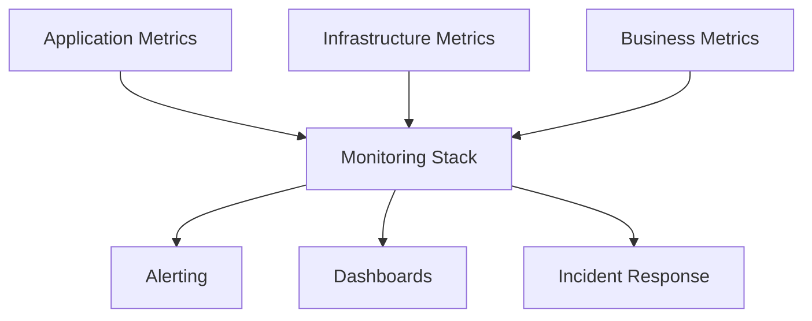

# Operations Guide for rwwwrse

This guide provides comprehensive operational procedures for monitoring, troubleshooting, and maintaining rwwwrse across all deployment scenarios. It covers monitoring strategies, logging, alerting, performance optimization, and disaster recovery procedures.

## Overview

Effective operations management for rwwwrse involves:

- **Comprehensive monitoring** across all deployment platforms
- **Centralized logging** and log analysis
- **Proactive alerting** and incident response
- **Performance monitoring** and optimization
- **Security monitoring** and compliance
- **Disaster recovery** and business continuity
- **Capacity planning** and scaling strategies

## Monitoring Architecture

### Multi-Layer Monitoring Strategy



### Platform-Specific Monitoring

| Platform | Native Monitoring | Third-Party Options | Custom Metrics |
|----------|------------------|---------------------|----------------|
| Docker Compose | cAdvisor + Prometheus | Grafana, DataDog | Custom exporters |
| Kubernetes | Metrics Server, kube-state-metrics | Prometheus Operator | ServiceMonitor CRDs |
| AWS ECS | CloudWatch Container Insights | DataDog, New Relic | Custom CloudWatch metrics |
| Google Cloud Run | Cloud Monitoring | Grafana Cloud | Cloud Monitoring API |
| Azure ACI | Azure Monitor | Application Insights | Custom metrics API |
| Bare Metal | Node Exporter | Zabbix, Nagios | Custom Prometheus exporters |

## Application Metrics

### Health and Readiness Checks

rwwwrse exposes standard health endpoints:

```bash
# Health check endpoint
curl http://localhost:8080/health

# Expected response
{
  "status": "healthy",
  "timestamp": "2023-12-01T10:00:00Z",
  "version": "1.0.0",
  "uptime": "24h30m15s",
  "checks": {
    "database": "healthy",
    "redis": "healthy",
    "external_api": "healthy"
  }
}
```

### Metrics Endpoint

```bash
# Prometheus metrics
curl http://localhost:8080/metrics

# Key metrics exposed:
# - rwwwrse_requests_total{method,path,status}
# - rwwwrse_request_duration_seconds{method,path}
# - rwwwrse_active_connections
# - rwwwrse_backend_requests_total{backend,status}
# - rwwwrse_backend_response_time{backend}
# - go_memstats_alloc_bytes
# - go_goroutines
```

### Custom Metrics Configuration

```yaml
# Environment variables for metrics
environment:
  - RWWWRSE_METRICS_ENABLED=true
  - RWWWRSE_METRICS_PATH=/metrics
  - RWWWRSE_METRICS_INTERVAL=15s
  - RWWWRSE_DETAILED_METRICS=true
```

## Logging Strategy

### Structured Logging Configuration

```yaml
# JSON logging for production
environment:
  - RWWWRSE_LOG_FORMAT=json
  - RWWWRSE_LOG_LEVEL=info
  - RWWWRSE_LOG_OUTPUT=stdout
  - RWWWRSE_REQUEST_LOGGING=true
  - RWWWRSE_ERROR_STACK_TRACE=true
```

### Log Levels and Usage

| Level | Usage | Example |
|-------|-------|---------|
| `error` | Critical errors requiring attention | Backend connection failures, authentication errors |
| `warn` | Warning conditions | High response times, rate limiting triggered |
| `info` | General information | Request routing, configuration changes |
| `debug` | Detailed debugging information | Request/response bodies, internal state |

### Platform-Specific Log Aggregation

#### Docker Compose with ELK Stack

```yaml
# Filebeat configuration for log shipping
filebeat.inputs:
- type: container
  paths:
    - '/var/lib/docker/containers/*/*.log'
  processors:
  - add_docker_metadata:
      host: "unix:///var/run/docker.sock"

output.elasticsearch:
  hosts: ["elasticsearch:9200"]
```

#### Kubernetes with Fluentd

```yaml
# Fluentd DaemonSet for log collection
apiVersion: apps/v1
kind: DaemonSet
metadata:
  name: fluentd
spec:
  template:
    spec:
      containers:
      - name: fluentd
        image: fluent/fluentd-kubernetes-daemonset:v1-debian-elasticsearch
        env:
        - name: FLUENT_ELASTICSEARCH_HOST
          value: "elasticsearch.logging.svc.cluster.local"
```

#### Cloud Platform Logging

```bash
# AWS CloudWatch Logs
aws logs create-log-group --log-group-name /ecs/rwwwrse

# Google Cloud Logging
gcloud logging sinks create rwwwrse-sink \
  bigquery.googleapis.com/projects/PROJECT/datasets/rwwwrse_logs

# Azure Monitor Logs
az monitor log-analytics workspace create \
  --resource-group rwwwrse-rg \
  --workspace-name rwwwrse-logs
```

## Alerting and Incident Response

### Alert Categories

#### Critical Alerts (Immediate Response)

```yaml
# Service unavailable
- alert: ServiceDown
  expr: up{job="rwwwrse"} == 0
  for: 1m
  labels:
    severity: critical
  annotations:
    summary: "rwwwrse service is down"
    
# High error rate
- alert: HighErrorRate
  expr: rate(rwwwrse_requests_total{status=~"5.."}[5m]) > 0.1
  for: 2m
  labels:
    severity: critical
```

#### Warning Alerts (Investigation Required)

```yaml
# High response time
- alert: HighResponseTime
  expr: histogram_quantile(0.95, rate(rwwwrse_request_duration_seconds_bucket[5m])) > 1
  for: 5m
  labels:
    severity: warning

# High memory usage
- alert: HighMemoryUsage
  expr: go_memstats_alloc_bytes / go_memstats_sys_bytes > 0.8
  for: 10m
  labels:
    severity: warning
```

### Notification Channels

```yaml
# Alertmanager configuration
route:
  group_by: ['alertname']
  group_wait: 10s
  group_interval: 10s
  repeat_interval: 1h
  receiver: 'web.hook'
  routes:
  - match:
      severity: critical
    receiver: pagerduty
  - match:
      severity: warning
    receiver: slack

receivers:
- name: 'pagerduty'
  pagerduty_configs:
  - service_key: 'PAGERDUTY_SERVICE_KEY'
    
- name: 'slack'
  slack_configs:
  - api_url: 'SLACK_WEBHOOK_URL'
    channel: '#alerts'
```

### Incident Response Procedures

#### 1. Immediate Response (< 5 minutes)

- **Acknowledge** the alert in monitoring system
- **Assess** the scope and impact of the issue
- **Check** service health dashboards
- **Verify** if it's a false positive
- **Escalate** if critical service impact

#### 2. Investigation (< 15 minutes)

- **Review** recent deployments and changes
- **Check** application and infrastructure logs
- **Analyze** metrics and performance data
- **Identify** potential root causes
- **Implement** immediate mitigations if possible

#### 3. Resolution (Variable)

- **Apply** permanent fixes
- **Monitor** service recovery
- **Verify** all systems are functioning normally
- **Document** the incident and resolution
- **Conduct** post-incident review

## Performance Monitoring

### Key Performance Indicators (KPIs)

#### Application Performance

- **Response Time**: P50, P95, P99 latencies
- **Throughput**: Requests per second
- **Error Rate**: 4xx and 5xx response rates
- **Availability**: Service uptime percentage

#### Infrastructure Performance

- **CPU Utilization**: Average and peak usage
- **Memory Usage**: Heap and non-heap utilization
- **Network I/O**: Bandwidth and latency
- **Disk I/O**: Read/write operations and latency

#### Business Metrics

- **Active Users**: Concurrent connections
- **Feature Usage**: Route-specific metrics
- **Geographic Distribution**: Request origins
- **Peak Load Patterns**: Traffic distribution

### Performance Optimization

#### Application Level

```go
// Enable Go runtime profiling
import _ "net/http/pprof"

// Add profiling endpoint
go func() {
    log.Println(http.ListenAndServe("localhost:6060", nil))
}()
```

```bash
# CPU profiling
go tool pprof http://localhost:6060/debug/pprof/profile?seconds=30

# Memory profiling
go tool pprof http://localhost:6060/debug/pprof/heap

# Goroutine analysis
go tool pprof http://localhost:6060/debug/pprof/goroutine
```

#### Infrastructure Level

```yaml
# Kubernetes resource optimization
resources:
  requests:
    memory: "128Mi"
    cpu: "100m"
  limits:
    memory: "512Mi"
    cpu: "500m"

# Horizontal Pod Autoscaler
apiVersion: autoscaling/v2
kind: HorizontalPodAutoscaler
spec:
  scaleTargetRef:
    apiVersion: apps/v1
    kind: Deployment
    name: rwwwrse
  minReplicas: 2
  maxReplicas: 10
  metrics:
  - type: Resource
    resource:
      name: cpu
      target:
        type: Utilization
        averageUtilization: 70
```

## Security Monitoring

### Security Metrics and Alerts

```yaml
# Security-related alerts
- alert: SuspiciousTraffic
  expr: rate(rwwwrse_requests_total{status="401"}[5m]) > 10
  for: 1m
  labels:
    severity: warning
  annotations:
    summary: "High number of unauthorized requests"

- alert: DDoSAttempt
  expr: rate(rwwwrse_requests_total[1m]) > 1000
  for: 30s
  labels:
    severity: critical
  annotations:
    summary: "Potential DDoS attack detected"
```

### Access Monitoring

```bash
# Monitor failed authentication attempts
grep "status.*401" /var/log/rwwwrse/access.log | \
  awk '{print $1}' | sort | uniq -c | sort -nr

# Check for unusual request patterns
grep "status.*[45][0-9][0-9]" /var/log/rwwwrse/access.log | \
  awk '{print $7}' | sort | uniq -c | sort -nr
```

### Compliance Monitoring

```yaml
# Audit logging configuration
environment:
  - RWWWRSE_AUDIT_ENABLED=true
  - RWWWRSE_AUDIT_LOG_PATH=/var/log/rwwwrse/audit.log
  - RWWWRSE_AUDIT_EVENTS=auth,admin,config
```

## Troubleshooting Guide

### Common Issues and Solutions

#### 1. High Response Times

**Symptoms:**

- P95 latency > 1 second
- User complaints about slow performance
- Increased error rates

**Investigation:**

```bash
# Check application metrics
curl http://localhost:8080/metrics | grep rwwwrse_request_duration

# Analyze slow queries
grep "response_time.*[5-9][0-9][0-9][0-9]" /var/log/rwwwrse/access.log

# Check resource utilization
top -p $(pgrep rwwwrse)
```

**Solutions:**

- Scale horizontally (add more instances)
- Optimize database queries
- Implement caching
- Review resource limits

#### 2. Memory Leaks

**Symptoms:**

- Gradually increasing memory usage
- Out of memory errors
- Pod/container restarts

**Investigation:**

```bash
# Memory profiling
go tool pprof http://localhost:6060/debug/pprof/heap

# Check goroutine leaks
go tool pprof http://localhost:6060/debug/pprof/goroutine

# Monitor memory metrics
curl http://localhost:8080/metrics | grep go_memstats
```

**Solutions:**

- Review goroutine lifecycle management
- Check for unclosed resources
- Implement proper context cancellation
- Update Go runtime if needed

#### 3. Connection Pool Exhaustion

**Symptoms:**

- "connection refused" errors
- Timeouts connecting to backends
- High connection counts

**Investigation:**

```bash
# Check connection metrics
netstat -an | grep :8080 | wc -l

# Monitor backend connections
curl http://localhost:8080/metrics | grep backend_connections

# Check connection pool settings
env | grep RWWWRSE_.*POOL
```

**Solutions:**

- Increase connection pool sizes
- Implement connection pooling
- Review timeout configurations
- Optimize connection reuse

#### 4. SSL/TLS Certificate Issues

**Symptoms:**

- SSL handshake failures
- Certificate expiration warnings
- Browser security warnings

**Investigation:**

```bash
# Check certificate validity
openssl x509 -in /path/to/cert.pem -text -noout

# Test SSL connection
openssl s_client -connect example.com:443 -servername example.com

# Check certificate expiration
openssl x509 -in /path/to/cert.pem -noout -dates
```

**Solutions:**

- Renew expired certificates
- Update certificate chain
- Verify certificate configuration
- Implement automated renewal

### Platform-Specific Troubleshooting

#### Docker Compose

```bash
# Check container status
docker-compose ps

# View container logs
docker-compose logs rwwwrse

# Debug networking
docker-compose exec rwwwrse netstat -tlnp

# Resource usage
docker stats
```

#### Kubernetes

```bash
# Check pod status
kubectl get pods -l app=rwwwrse

# View pod logs
kubectl logs -l app=rwwwrse --tail=100

# Debug networking
kubectl exec -it rwwwrse-pod -- netstat -tlnp

# Check resource usage
kubectl top pods
```

#### Cloud Platforms

```bash
# AWS ECS
aws ecs describe-tasks --cluster rwwwrse-cluster --tasks task-id
aws logs get-log-events --log-group-name /ecs/rwwwrse

# Google Cloud Run
gcloud run services describe rwwwrse --region=us-central1
gcloud logging read "resource.type=cloud_run_revision"

# Azure Container Instances
az container logs --resource-group rwwwrse-rg --name rwwwrse
az monitor metrics list --resource /subscriptions/.../rwwwrse
```

## Disaster Recovery

### Backup Strategies

#### Configuration Backup

```bash
#!/bin/bash
# Backup script for rwwwrse configuration

BACKUP_DIR="/var/backups/rwwwrse/$(date +%Y%m%d_%H%M%S)"
mkdir -p "$BACKUP_DIR"

# Backup configuration files
cp -r /etc/rwwwrse/ "$BACKUP_DIR/config/"

# Backup environment variables
env | grep RWWWRSE_ > "$BACKUP_DIR/environment.env"

# Backup SSL certificates
cp -r /etc/ssl/rwwwrse/ "$BACKUP_DIR/ssl/"

# Create backup manifest
cat > "$BACKUP_DIR/manifest.json" << EOF
{
  "timestamp": "$(date -u +%Y-%m-%dT%H:%M:%SZ)",
  "version": "$(rwwwrse --version)",
  "environment": "production",
  "components": ["config", "environment", "ssl"]
}
EOF

echo "Backup completed: $BACKUP_DIR"
```

#### Database Backup

```bash
# Application data backup
pg_dump rwwwrse_db > "rwwwrse_db_$(date +%Y%m%d).sql"

# Redis backup
redis-cli --rdb "rwwwrse_redis_$(date +%Y%m%d).rdb"
```

### Recovery Procedures

#### 1. Service Recovery

```bash
# Stop failed service
systemctl stop rwwwrse

# Restore from backup
tar -xzf rwwwrse-backup-latest.tar.gz -C /

# Restart service
systemctl start rwwwrse

# Verify recovery
curl http://localhost:8080/health
```

#### 2. Database Recovery

```bash
# Stop application
systemctl stop rwwwrse

# Restore database
psql rwwwrse_db < rwwwrse_db_backup.sql

# Restart application
systemctl start rwwwrse
```

#### 3. Full Environment Recovery

```yaml
# Kubernetes disaster recovery
apiVersion: v1
kind: ConfigMap
metadata:
  name: disaster-recovery-playbook
data:
  recovery.sh: |
    #!/bin/bash
    
    # 1. Restore from backup
    kubectl apply -f backup/manifests/
    
    # 2. Wait for pods to be ready
    kubectl wait --for=condition=ready pod -l app=rwwwrse --timeout=300s
    
    # 3. Verify service health
    kubectl exec -it $(kubectl get pod -l app=rwwwrse -o name | head -1) -- \
      curl -f http://localhost:8080/health
    
    # 4. Update DNS if needed
    # (implementation depends on DNS provider)
    
    echo "Disaster recovery completed"
```

## Capacity Planning

### Resource Monitoring

```bash
# CPU usage trends
prometheus_query='rate(cpu_usage_seconds_total[5m])'

# Memory usage trends
prometheus_query='avg_over_time(memory_usage_bytes[24h])'

# Request rate trends
prometheus_query='rate(rwwwrse_requests_total[5m])'
```

### Scaling Recommendations

| Metric | Threshold | Action |
|--------|-----------|--------|
| CPU Usage | > 70% for 5 minutes | Scale up |
| Memory Usage | > 80% | Add memory or scale up |
| Response Time | P95 > 1s | Investigate and scale |
| Error Rate | > 1% | Investigate immediately |
| Connection Count | > 80% of limit | Increase limits or scale |

### Auto-Scaling Configuration

```yaml
# Kubernetes HPA with custom metrics
apiVersion: autoscaling/v2
kind: HorizontalPodAutoscaler
metadata:
  name: rwwwrse-hpa
spec:
  scaleTargetRef:
    apiVersion: apps/v1
    kind: Deployment
    name: rwwwrse
  minReplicas: 2
  maxReplicas: 20
  metrics:
  - type: Resource
    resource:
      name: cpu
      target:
        type: Utilization
        averageUtilization: 70
  - type: Pods
    pods:
      metric:
        name: rwwwrse_requests_per_second
      target:
        type: AverageValue
        averageValue: "100"
  behavior:
    scaleUp:
      stabilizationWindowSeconds: 60
      policies:
      - type: Percent
        value: 100
        periodSeconds: 15
    scaleDown:
      stabilizationWindowSeconds: 300
      policies:
      - type: Percent
        value: 10
        periodSeconds: 60
```

## Operational Runbooks

### Daily Operations Checklist

```markdown
- [ ] Check service health dashboards
- [ ] Review overnight alerts and incidents
- [ ] Verify backup completion
- [ ] Check resource utilization trends
- [ ] Review security alerts
- [ ] Validate SSL certificate expiration dates
- [ ] Check for available updates
```

### Weekly Operations Tasks

```markdown
- [ ] Review capacity planning metrics
- [ ] Analyze performance trends
- [ ] Update monitoring thresholds if needed
- [ ] Review and update documentation
- [ ] Security vulnerability assessment
- [ ] Disaster recovery test (quarterly)
```

### Emergency Response Procedures

#### Service Outage Response

1. **Immediate Actions (0-5 minutes)**
   - Check service status across all environments
   - Verify if it's a widespread issue
   - Check infrastructure status (cloud provider, DNS)
   - Implement immediate workarounds if available

2. **Investigation (5-15 minutes)**
   - Review recent deployments and changes
   - Analyze logs and metrics
   - Check dependencies and external services
   - Identify root cause

3. **Resolution (15+ minutes)**
   - Implement fix or rollback
   - Monitor service recovery
   - Update stakeholders
   - Document incident

#### Performance Degradation Response

1. **Assessment**
   - Quantify performance impact
   - Identify affected components
   - Check resource utilization

2. **Mitigation**
   - Scale resources if needed
   - Implement rate limiting
   - Cache frequently accessed data

3. **Resolution**
   - Optimize identified bottlenecks
   - Monitor improvement
   - Plan long-term solutions

## Best Practices

### Monitoring Best Practices

1. **Use the Four Golden Signals**
   - Latency, Traffic, Errors, Saturation

2. **Implement SLIs and SLOs**
   - Service Level Indicators (SLIs)
   - Service Level Objectives (SLOs)
   - Error budgets

3. **Alert on Symptoms, Not Causes**
   - Focus on user impact
   - Reduce alert fatigue

4. **Use Runbooks**
   - Document response procedures
   - Include investigation steps

### Security Best Practices

1. **Monitor Access Patterns**
   - Track authentication attempts
   - Monitor privilege escalations
   - Detect anomalous behavior

2. **Implement Defense in Depth**
   - Multiple security layers
   - Network segmentation
   - Regular security assessments

3. **Keep Systems Updated**
   - Regular security patches
   - Dependency updates
   - Certificate renewal

### Operational Excellence

1. **Automate Everything**
   - Deployment pipelines
   - Monitoring setup
   - Incident response

2. **Document Procedures**
   - Keep runbooks updated
   - Share knowledge across team
   - Regular documentation reviews

3. **Learn from Incidents**
   - Conduct post-mortems
   - Implement improvements
   - Share lessons learned

## Related Documentation

- [Deployment Guide](DEPLOYMENT.md) - Comprehensive deployment scenarios
- [Configuration Guide](CONFIGURATION.md) - Environment-specific configuration
- [SSL/TLS Guide](SSL-TLS.md) - Certificate management strategies
- [Development Guide](DEVELOPMENT.md) - Local development setup
- [Docker Compose Examples](../examples/docker-compose/) - Container-based deployments
- [Kubernetes Examples](../examples/kubernetes/) - Container orchestration
- [Cloud-Specific Examples](../examples/cloud-specific/) - Cloud platform deployments
- [CI/CD Examples](../examples/cicd/) - Automated deployment pipelines
