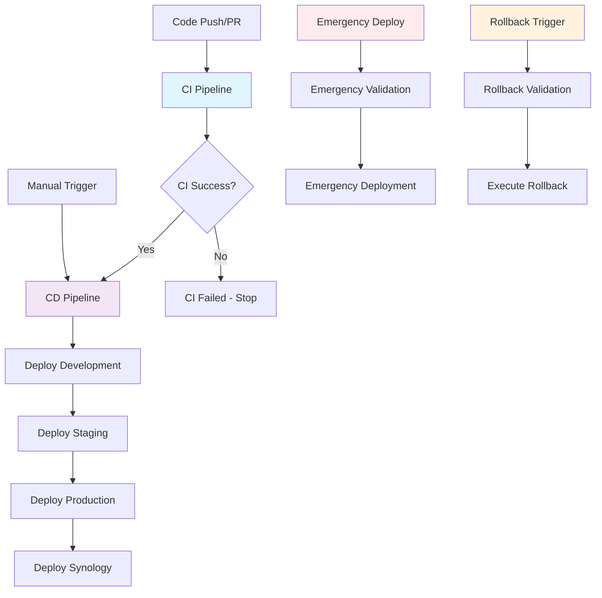

# CI/CD Workflow Dependencies and Triggers

This document describes the complete CI/CD pipeline workflow dependencies, triggers, and coordination mechanisms for the rwwwrse project.

## Overview

The CI/CD pipeline consists of multiple interconnected workflows that provide a complete deployment automation solution from code commit to production deployment, including emergency procedures and rollback capabilities.

## Workflow Architecture



## Core Workflows

### 1. CI Pipeline (`ci.yml`)

**Purpose**: Continuous Integration - builds, tests, and validates code changes.

**Triggers**:
- `push` to `main` or `develop` branches (excluding documentation)
- `pull_request` to `main` or `develop` branches
- `workflow_dispatch` for manual CI runs

**Dependencies**: None (entry point)

**Outputs**:
- `ci-status`: Overall CI pipeline status
- `image-tag`: Generated container image tag
- `image-digest`: Container image digest
- `coverage`: Test coverage percentage
- `security-passed`: Security scan results
- `build-artifacts`: Availability of build artifacts

**Jobs Flow**:
```
test → build → security → ci-summary
  ↓      ↓        ↓          ↓
  ✓      ✓        ✓      Outputs for CD
```

**Concurrency**: Cancels previous runs on new pushes to same branch

### 2. CD Pipeline (`cd.yml`)

**Purpose**: Continuous Deployment - orchestrates multi-environment deployments.

**Triggers**:
- `workflow_run` when CI Pipeline completes successfully
- `workflow_dispatch` for manual deployments

**Dependencies**: 
- Requires successful CI Pipeline completion (or force override)
- Consumes CI outputs for deployment decisions

**Deployment Strategy**:
```
validate-ci → deploy-development → deploy-staging → deploy-production → deploy-synology
     ↓              ↓                   ↓                ↓                    ↓
   Extract CI    Rolling Deploy    Blue-Green Deploy  Blue-Green Deploy  Docker Compose
   Artifacts                      (with approval)    (with approval)
```

**Environment-Specific Behavior**:
- **Development**: Auto-deploy on `develop` branch
- **Staging**: Auto-deploy on `main` branch (with approval)
- **Production**: Manual approval required
- **Synology**: Auto-deploy after production success

**Concurrency**: Prevents multiple deployments to same environment

### 3. Synology Deployment (`syno.yaml`)

**Purpose**: Self-hosted deployment to Synology NAS environment.

**Triggers**:
- `workflow_call` from CD Pipeline
- `workflow_dispatch` for manual Synology deployments

**Dependencies**:
- Called by CD Pipeline after production deployment
- Uses validated container images from CI/CD pipeline

**Special Features**:
- Runs on self-hosted runner with `synology` label
- Uses Docker Compose for deployment
- Includes comprehensive health checks
- Supports both pre-built and local image builds

### 4. Emergency Deployment (`emergency-deploy.yml`)

**Purpose**: Emergency deployment workflow for critical hotfixes.

**Triggers**:
- `workflow_dispatch` only (manual emergency deployments)

**Dependencies**: None (bypasses normal CI/CD flow)

**Emergency Features**:
- Skip CI pipeline validation (with force option)
- Skip approval gates (for critical emergencies)
- Skip tests (emergency only)
- Automatic issue creation for tracking
- Enhanced notifications to team

**Safety Mechanisms**:
- Image validation before deployment
- Emergency deployment tracking
- Comprehensive logging and audit trail

### 5. Rollback Workflow (`rollback.yml`)

**Purpose**: Rollback deployments to previous versions.

**Triggers**:
- `workflow_dispatch` only (manual rollback operations)

**Dependencies**: None (independent rollback capability)

**Rollback Types**:
- Previous version rollback
- Specific version rollback
- Last known good version rollback

**Safety Features**:
- Pre-rollback backup creation
- Rollback target validation
- Post-rollback health verification
- Automatic issue creation for tracking

## Workflow State Management

### Artifact Passing

The pipeline uses several mechanisms to pass state between workflows:

1. **CI Outputs**: CI pipeline provides structured outputs for CD consumption
2. **Workflow Run Context**: CD pipeline extracts metadata from triggering CI run
3. **Container Registry**: Validated images are stored and referenced by tag/digest
4. **GitHub Artifacts**: Build artifacts are stored for cross-workflow access

### State Validation

Each workflow validates its inputs and dependencies:

```yaml
# Example validation in CD pipeline
validate-ci:
  if: (github.event.workflow_run.conclusion == 'success' || inputs.force_deploy == true)
  steps:
    - name: Validate CI completion
      run: |
        if [ "$CI_CONCLUSION" != "success" ] && [ "${{ inputs.force_deploy }}" != "true" ]; then
          echo "❌ CI workflow failed and force_deploy is not enabled"
          exit 1
        fi
```

## Error Handling and Recovery

### Workflow Failure Scenarios

1. **CI Failure**: Stops pipeline, prevents CD trigger
2. **CD Deployment Failure**: Automatic rollback in reusable deploy workflow
3. **Synology Deployment Failure**: Isolated failure, doesn't affect other environments
4. **Emergency Deployment Failure**: Critical alerts, immediate escalation

### Recovery Mechanisms

1. **Automatic Rollback**: Built into deployment workflows
2. **Manual Rollback**: Dedicated rollback workflow
3. **Emergency Deployment**: Bypass normal pipeline for hotfixes
4. **Force Deployment**: Override CI failures for emergency situations

### Notification Strategy

All workflows include comprehensive notification mechanisms:

1. **Slack Notifications**: Real-time alerts to team channels
2. **Email Notifications**: Critical alerts for production issues
3. **GitHub Issues**: Automatic issue creation for failures
4. **GitHub Deployments**: Status updates in GitHub UI
5. **Monitoring Webhooks**: Integration with external monitoring systems

## Manual Override Capabilities

### Emergency Deployment

Use when immediate deployment is required bypassing normal CI/CD flow:

```bash
# Emergency deployment to production
gh workflow run emergency-deploy.yml \
  --field environment=production \
  --field image_tag=hotfix-v1.2.3 \
  --field reason="Critical security patch" \
  --field skip_tests=false \
  --field notify_team=true
```

### Rollback Operations

Use when deployment needs to be reverted:

```bash
# Rollback production to previous version
gh workflow run rollback.yml \
  --field environment=production \
  --field rollback_to=v1.2.2 \
  --field rollback_type=previous-version \
  --field reason="Performance regression detected"
```

### Force Deployment

Use CD pipeline with force override when CI failed but deployment is needed:

```bash
# Force deployment despite CI failure
gh workflow run cd.yml \
  --field environment=staging \
  --field image_tag=develop \
  --field force_deploy=true
```

## Operational Procedures

### Normal Deployment Flow

1. **Developer pushes code** to `develop` or `main` branch
2. **CI Pipeline triggers** automatically
3. **CD Pipeline triggers** on CI success
4. **Deployments proceed** based on branch and environment configuration
5. **Notifications sent** on completion or failure

### Emergency Procedures

1. **Assess urgency** and impact of the issue
2. **Choose appropriate workflow**:
   - Emergency deployment for hotfixes
   - Rollback for reverting problematic deployments
   - Force deployment for CI bypass scenarios
3. **Execute with proper parameters** and documentation
4. **Monitor deployment** and verify functionality
5. **Follow up** with proper incident documentation

### Monitoring and Alerting

- **Workflow Status**: Monitor in GitHub Actions UI
- **Application Health**: Automated health checks post-deployment
- **Performance Metrics**: Integration with monitoring systems
- **Error Tracking**: Automatic issue creation for failures

## Troubleshooting Guide

### Common Issues

#### CI Pipeline Failures

**Symptoms**: CI workflow fails, CD pipeline doesn't trigger
**Solutions**:
1. Check test failures in CI logs
2. Review security scan results
3. Verify build artifacts generation
4. Use manual CI trigger if needed

#### CD Pipeline Not Triggering

**Symptoms**: CI succeeds but CD doesn't start
**Solutions**:
1. Verify CI workflow name matches trigger
2. Check branch restrictions in CD workflow
3. Ensure CI completed successfully
4. Use manual CD trigger as workaround

#### Deployment Failures

**Symptoms**: Deployment job fails during execution
**Solutions**:
1. Check deployment logs for specific errors
2. Verify image availability in registry
3. Check environment configuration
4. Validate secrets and permissions
5. Consider rollback if critical

#### Synology Deployment Issues

**Symptoms**: Synology deployment fails or times out
**Solutions**:
1. Verify self-hosted runner status
2. Check Docker daemon on Synology
3. Validate network connectivity
4. Review compose file configuration
5. Check volume mount permissions

### Recovery Procedures

#### Failed Production Deployment

1. **Immediate**: Use rollback workflow to previous version
2. **Investigate**: Check logs and identify root cause
3. **Fix**: Address underlying issue
4. **Redeploy**: Use normal or emergency deployment as appropriate

#### CI/CD Pipeline Corruption

1. **Bypass**: Use emergency deployment for critical fixes
2. **Diagnose**: Review workflow configurations and dependencies
3. **Repair**: Fix workflow issues and test with non-critical changes
4. **Validate**: Ensure normal flow works before critical deployments

## Security Considerations

### Access Control

- **Workflow Dispatch**: Requires repository write access
- **Environment Protection**: Production requires approval
- **Secrets Management**: Sensitive data in GitHub secrets
- **Runner Security**: Self-hosted runners isolated and secured

### Audit Trail

- **Workflow Logs**: Complete execution history
- **GitHub Issues**: Automatic tracking for emergencies and rollbacks
- **Deployment Records**: GitHub deployment API integration
- **Notification History**: Slack and email records

### Emergency Access

- **Emergency Deployment**: Bypass normal approvals when critical
- **Force Deployment**: Override CI failures when necessary
- **Rollback Authority**: Quick reversion capabilities
- **Escalation Procedures**: Clear chain of responsibility

## Best Practices

### Development Workflow

1. **Feature Branches**: Use feature branches for development
2. **Pull Requests**: Require PR reviews before merging
3. **CI Validation**: Ensure CI passes before merging
4. **Incremental Deployment**: Use staging before production

### Deployment Strategy

1. **Blue-Green**: Use for production deployments
2. **Rolling Updates**: Use for development/staging
3. **Health Checks**: Always verify deployment health
4. **Rollback Plan**: Have rollback strategy ready

### Emergency Response

1. **Assessment**: Quickly assess impact and urgency
2. **Communication**: Notify team of emergency procedures
3. **Documentation**: Document all emergency actions
4. **Post-Mortem**: Conduct review after resolution

## Configuration Reference

### Required Secrets

```yaml
# GitHub Repository Secrets
SLACK_WEBHOOK_URL: "https://hooks.slack.com/..."
SMTP_SERVER: "smtp.example.com"
SMTP_PORT: "587"
SMTP_USERNAME: "notifications@example.com"
SMTP_PASSWORD: "smtp-password"
SMTP_FROM: "CI/CD Pipeline <cicd@example.com>"
NOTIFICATION_EMAIL: "team@example.com"
MONITORING_WEBHOOK_URL: "https://monitoring.example.com/webhook"

# Kubernetes Secrets (per environment)
KUBECONFIG_DEV: "base64-encoded-kubeconfig"
KUBECONFIG_STAGING: "base64-encoded-kubeconfig"
KUBECONFIG_PROD: "base64-encoded-kubeconfig"
```

### Environment Variables

```yaml
# Global Configuration
GO_VERSION: "1.21"
REGISTRY: "ghcr.io"
IMAGE_NAME: "${{ github.repository }}"

# Feature Flags
ENABLE_SLACK_NOTIFICATIONS: "true"
ENABLE_EMAIL_NOTIFICATIONS: "true"
```

### Self-Hosted Runner Requirements

- **Synology NAS** with Docker and Docker Compose
- **GitHub Actions Runner** installed and configured
- **Runner Labels**: `self-hosted`, `synology`
- **Network Access**: GitHub Container Registry access
- **Permissions**: Docker daemon access, volume mount permissions

## Maintenance

### Regular Tasks

1. **Update Dependencies**: Keep workflow actions up to date
2. **Review Secrets**: Rotate secrets regularly
3. **Monitor Performance**: Track workflow execution times
4. **Update Documentation**: Keep procedures current

### Periodic Reviews

1. **Security Audit**: Review access controls and permissions
2. **Performance Analysis**: Optimize slow workflows
3. **Failure Analysis**: Review and improve error handling
4. **Process Improvement**: Update procedures based on lessons learned

---

For additional support or questions about the CI/CD pipeline, please refer to the [main CI/CD documentation](README.md) or contact the DevOps team.